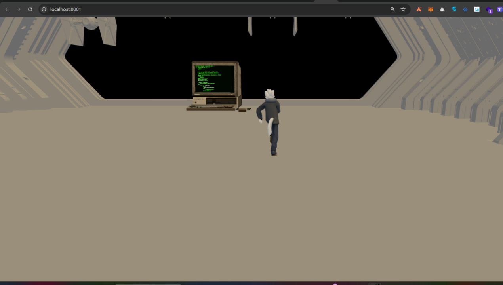
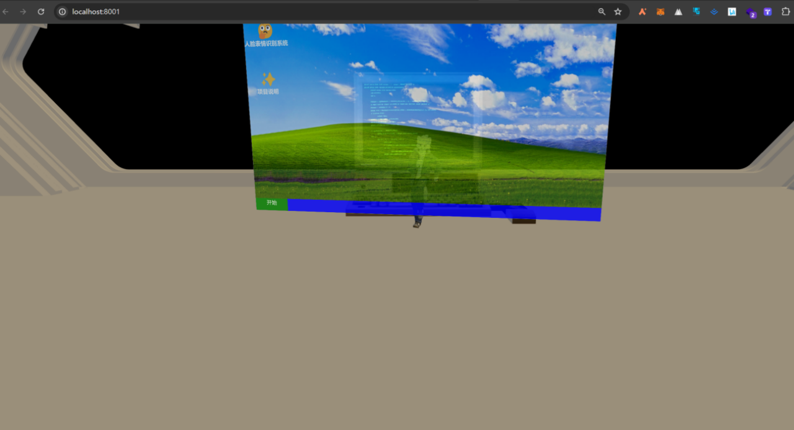
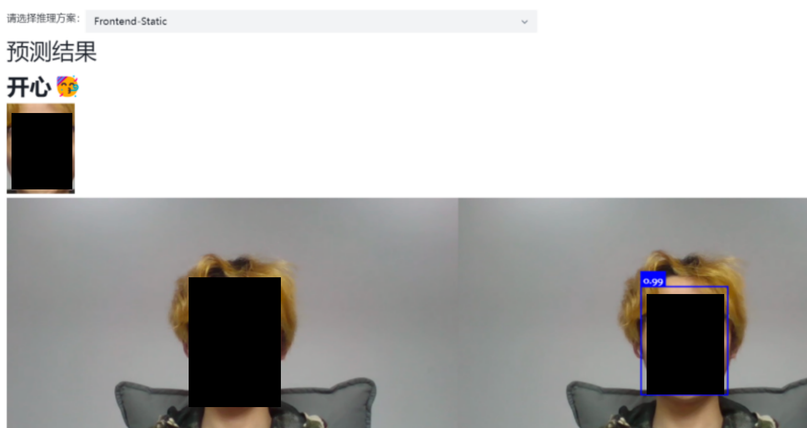
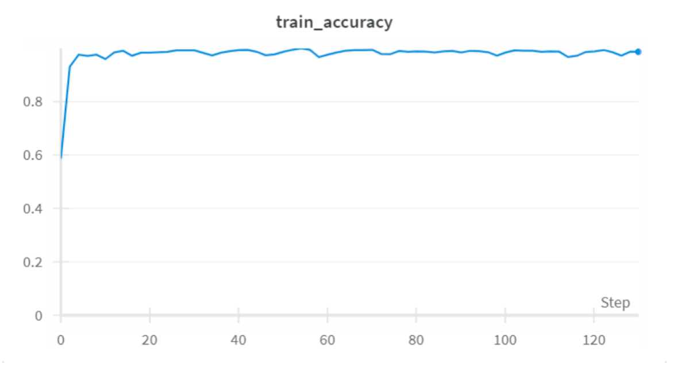
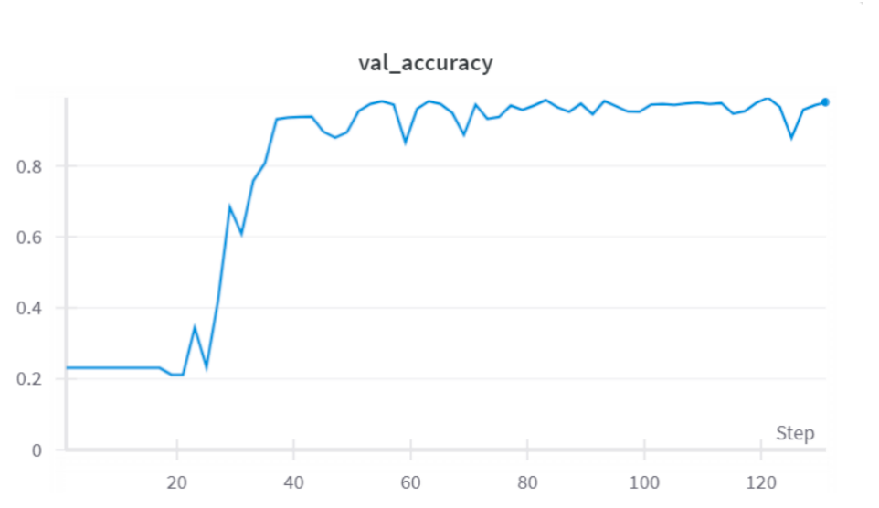
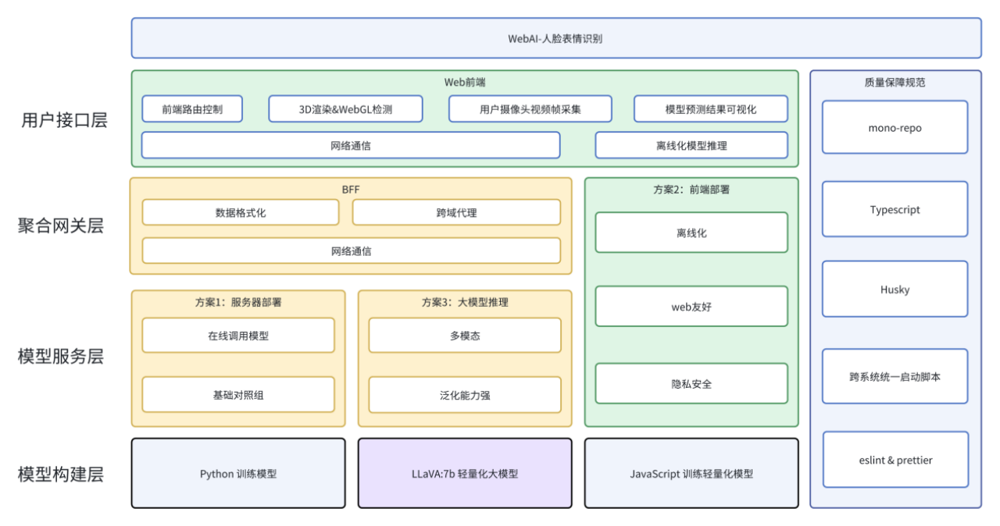

# Web-AI Solutions

## 项目背景
### 简介

项目的核心特色在于利用 AI 技术实现人脸表情识别，同时结合 3D 交互以增强人机交互的真实感与趣味性。
具体而言，这里使用了三种方式实现了人脸表情识别：

- 服务器端使用 TensorFlow 训练 MobileNetV3 模型
- 浏览器端使用 TensorFlow.js 加载 MobileNetV3 模型
- 浏览器端使用 Ollama 部署 Laava 7B 多模态大模型

此外，对于 3D 场景则是使用 [Lec3d.js](https://github.com/lec-org/lec3d) 库实现（鄙人基于自己的 Three.js 开发经验封装的一个玩具库），由于本项目重心不是构建 3D 场景，同时自己对于 Three.js 还处于探索阶段，所以 3D 场景相对有些粗糙。

> 3D 模型是网上找的，然后现学现卖 Blender 自己微调了一下，同时加了个运动的动画。

### 效果预览

控制角色移动靠近电脑模型后，打开平面面板（这个面板其实是单独开了一个渲染管线实现的，是3D场景中没有厚度的2D平面），点击面板上的按钮，即可开始进行人脸表情识别。

> 感觉自己为了一碟醋包了一盘饺子

至于运行效果，这里简单展示下：
> 长得丑，打码遮一下

## 技术实现
### MobileNetV3 

#### 模型特点

MobileNetV3 是 Google 提出的轻量级神经网络架构，专为移动设备和边缘计算设计。主要特点：

- **结构改进**：引入高效瓶颈结构和 SE 机制
- **激活函数**：采用Hard-Swish激活函数
- **模型变体**：提供Small和Large两个版本

#### 模型具体结构

具体结构如下：

| 输入          | 操作符               | exp | 输出尺寸 | SE | NL | Stride |
|---------------|----------------------|-----|----------|----|----|--------|
| 224² x 3     | conv2d              | -   | 16       | -  | HS | 2      |
| 112² x 16    | bottleneck, 3x3     | 16  | 16       | -  | RE | 1      |
| 112² x 16    | bottleneck, 3x3     | 64  | 24       | -  | RE | 2      |
| 56² x 24     | bottleneck, 3x3     | 72  | 24       | √  | RE | 1      |
| 56² x 24     | bottleneck, 5x5     | 72  | 40       | √  | RE | 2      |
| 28² x 40     | bottleneck, 5x5     | 120 | 40       | √  | RE | 1      |
| 28² x 40     | bottleneck, 5x5     | 120 | 40       | √  | RE | 1      |
| 28² x 40     | bottleneck, 3x3     | 240 | 80       | -  | HS | 2      |
| 14² x 80     | bottleneck, 3x3     | 200 | 80       | -  | HS | 1      |
| 14² x 80     | bottleneck, 3x3     | 184 | 80       | -  | HS | 1      |
| 14² x 80     | bottleneck, 3x3     | 184 | 80       | -  | HS | 1      |
| 14² x 80     | bottleneck, 3x3     | 480 | 112      | √  | HS | 1      |
| 14² x 112    | bottleneck, 3x3     | 672 | 112      | √  | HS | 1      |
| 14² x 112    | bottleneck, 5x5     | 672 | 160      | √  | HS | 1      |
| 7² x 160     | bottleneck, 5x5     | 960 | 160      | √  | HS | 1      |
| 7² x 160     | bottleneck, 5x5     | 960 | 160      | √  | HS | 1      |
| 7² x 160     | conv2d, 1x1         | -   | 960      | -  | HS | 1      |
| 7² x 960     | pool, 7x7           | -   | -        | -  | -  | 1      |
| 1² x 960     | conv2d 1x1, NBN     | -   | 1280     | -  | HS | 1      |
| 1² x 1280    | conv2d 1x1, NBN     | -   | k        | -  | -  | 1      |

#### 激活函数

ReLU 是深度学习中最常用的激活函数之一，其优点包括计算简单、能有效缓解梯度消失问题，并加速神经网络的训练。其定义为：

$$
f(x) = \max(x, 0) 
$$

然而，ReLU 函数的一个缺点是其输出在负值区域恒为 0，这可能导致某些神经元失效，不再参与后续的训练过程（死神经元问题）。

ReLU6 是 ReLU 的一个变种，旨在限制输出范围在 [0, 6] 之间，以适应某些硬件（如移动端）上的低精度运算（如 float16 或 int8），提高数值稳定性。ReLU6 的定义为：

$$
f(x) = \min(\text{ReLU}(x), 6) 
$$

这意味着当输入值小于 0 时，输出为 0；当输入值大于 6 时，输出为 6；在 0 到 6 之间，则输出等于输入值。这有助于在低精度运算时保持良好的数值分辨率。

Hard-Swish 是 ReLU6 的一个改良，旨在进一步提升模型的非线性表达能力。其函数形式为：

$$
f(x) = \frac{x \cdot \text{ReLU6}(x + 3)}{6} 
$$

Hard-Swish 在负值区域能够产生更平滑的非零输出，相比于 ReLU 和 ReLU6，这可以增强模型的表达能力，并在某些任务上提高模型的性能。然而，Hard-Swish 涉及除法运算，这比 ReLU6 的计算开销更高。

#### 与前代版本对比

**对比MobileNetV1**
- 引入深度可分离卷积
- 加入Squeeze-and-Excitation机制
- 使用新的激活函数

**对比MobileNetV2**
- 继承深度可分离卷积和倒残差结构
- 优化网络架构
- 引入更高效的瓶颈块
- 采用Hard-Swish激活函数

#### 模型性能

训练了好几版，根据wandb观测，大部分都是这个水平：

训练集：

验证集：
> 这里没有做多折交叉验证，比较懒，所以这个数据仅供参考

### 3D 场景

#### 角色动态转向机制

为了能够处理角色移动和配合**根据当前镜头朝向转向**的逻辑，在 3D 场景中建立了一个三维坐标系，然后可以设置一个基准方向向量，其表示为：

$$
\text{Base} = \mathbf{P} - \mathbf{C}
$$

其中， P 为角色朝向方向向量，C 为镜头朝向方向向量。

当用户通过控制器输入移动时，在每一帧（约为 16.6ms）内，角色将根据输入的方向进行移动。具体来说，角色的移动方向可以表示为：

$$
\text{Move} = \begin{bmatrix} 0 & -1 \\ 1 & 0 \end{bmatrix} \text{Base} 
$$

其中，Move 表示角色的移动方向向量，也就是角色在下一帧中将要朝向的方向，通过这样的方式，就实现了角色在不同视角下都能较为合理地转向，

### 工程架构

直接看图：

## 协议

采用 MIT 协议开源，请遵守协议内容。
